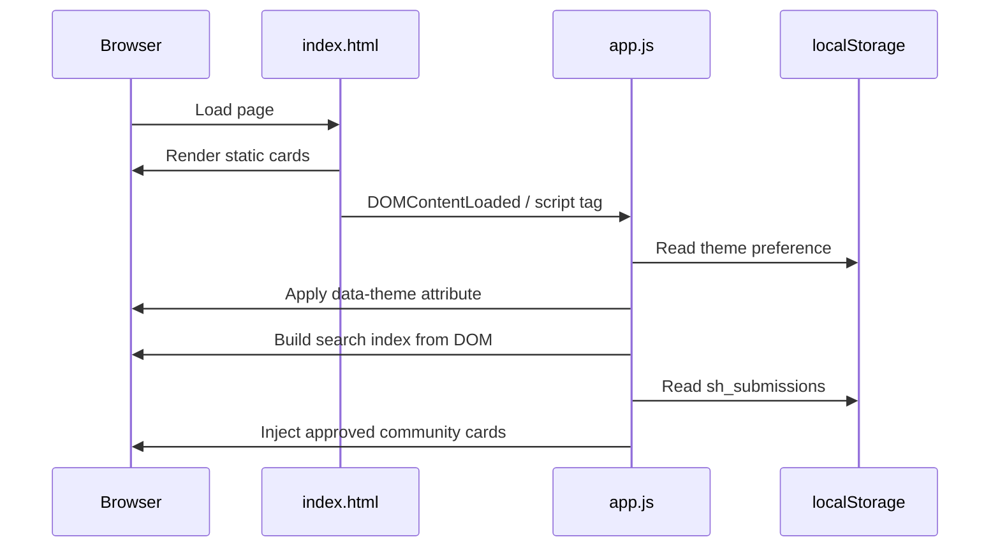
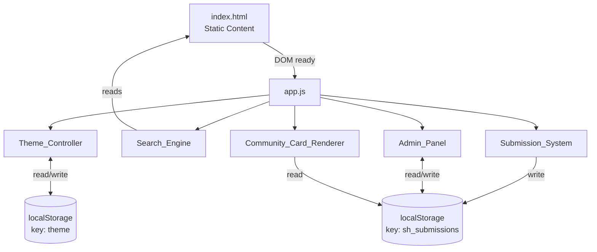

# Design Document — StudentHelper

## Overview

StudentHelper is a static, single-page web application that serves as a curated directory of free tools and resources for students. It is built with plain HTML5, CSS3, and vanilla JavaScript (ES6+) — no frameworks, no build step, no backend. All persistent state lives in the browser's `localStorage`.

The application is structured as a single HTML file (`index.html`) with an external stylesheet (`style.css`) and a single JavaScript module (`app.js`). It is designed to be hosted on any static file host (GitHub Pages, Netlify, etc.) and to work entirely in the browser without any server-side logic.

### Design Goals

- Zero dependencies — no npm, no bundler, no CDN scripts
- Instant load — all content is static HTML, no async data fetching
- Progressive enhancement — the page is readable even without JavaScript
- Accessible by default — semantic HTML, ARIA attributes, keyboard navigation
- Secure by default — all user content is HTML-escaped before DOM insertion

---

## Architecture

The application follows a simple layered architecture with three files:

```
FrontEnd/html/
├── index.html          # Page structure, static card content, modal markup
├── css/
│   └── style.css       # All styles, dark/light theme via CSS custom properties
└── scripts/
    └── app.js          # All runtime behaviour (theme, search, submissions, admin)
```

### Execution Flow



### Component Interaction



---

## Components and Interfaces

### 1. Theme_Controller

Responsible for toggling and persisting the dark/light colour theme.

**Initialisation** (runs immediately on script load, before DOMContentLoaded):
```js
const savedTheme = localStorage.getItem('theme') || 'dark';
html.setAttribute('data-theme', savedTheme);
themeToggle.textContent = savedTheme === 'dark' ? '🌙' : '☀️';
```

**Toggle handler**:
```js
themeToggle.addEventListener('click', () => {
    const next = current === 'dark' ? 'light' : 'dark';
    html.setAttribute('data-theme', next);
    localStorage.setItem('theme', next);
    themeToggle.textContent = next === 'dark' ? '🌙' : '☀️';
});
```

**Interface**:
- Input: click event on `#themeToggle`
- Output: `data-theme` attribute on `<html>`, `localStorage['theme']`, button icon

---

### 2. Search_Engine

Provides live, client-side full-text search across all resource cards.

**Index construction** (runs once on DOMContentLoaded by querying the static DOM):
```js
document.querySelectorAll('.category').forEach(section => {
    const catName = section.querySelector('h2').textContent.trim();
    section.querySelectorAll('.card').forEach(card => {
        allCards.push({ title, desc, tag, href, category: catName });
    });
});
```

The index is built from the live DOM, which means community cards injected after page load are **not** included in the initial index. This is a known limitation — the search index is a snapshot taken at DOMContentLoaded.

**Filter function** (`renderResults(query)`):
- Lowercases both query and all fields
- Substring match across `title`, `desc`, `tag`, `category`
- Renders `<a class="search-result-item">` elements with `target="_blank" rel="noopener"`
- Shows "No results found." when `matches.length === 0`
- Hides dropdown when query is empty

**Interface**:
- Input: `input` event on `#searchInput`
- Output: `#searchResults` dropdown content and visibility

---

### 3. Submission_System

Handles the community resource submission workflow via a modal form.

**FAB → Modal flow**:
- `#fabSubmit` click → remove `hidden` class from `#submitOverlay`
- Close button / overlay click → `closeSubmitModal()` → `resetForm()`

**Form validation** (on submit):
1. Check all required fields are non-empty
2. Validate URL with `new URL(url)` — throws on invalid input
3. On failure: show `#formError` with message, do not save
4. On success: create submission object, push to `localStorage`, show `#formSuccess`

**Character counter**: `input` event on `#f-desc` updates `#descCount` text to `"N / 160"`.

**Interface**:
- Input: form submit event
- Output: `localStorage['sh_submissions']` array, modal state

---

### 4. Admin_Panel

Password-protected review interface for approving or rejecting submissions.

**Trigger**: `keydown` event listener on `document`. Buffers the last 5 characters typed (ignoring input/textarea focus). When buffer equals `"admin"`, opens the admin modal and resets the login state.

**Authentication**: Hardcoded password `studenthelper2024` compared client-side. This is intentional for a static site — there is no server to authenticate against. The password provides a lightweight barrier, not cryptographic security.

**Review flow**:
- `renderAdminPanel(filter)` reads all submissions, groups by status, renders tabs and cards
- `reviewSubmission(id, status)` updates the submission in localStorage and re-renders
- On approve: also calls `renderApprovedCommunityCards()`

**Interface**:
- Input: keyboard events, button clicks
- Output: `localStorage['sh_submissions']` status updates, DOM re-render

---

### 5. Community_Card_Renderer

Injects approved community submissions into the correct category sections at runtime.

**Category → Section ID map** (hardcoded):
```js
const catMap = {
    'Study Tools': 'study-tools',
    'AI Tools': 'ai-tools',
    'Productivity Tools': 'productivity',
    'Note-Taking Apps': 'note-taking',
    'Coding Resources': 'coding',
    'Design Resources': 'design',
    'Scholarship / Internship Resources': 'scholarships',
    'Free Learning Websites': 'learning',
    'Student Discounts': 'discounts',
    'Useful Websites': 'useful',
};
```

**Render process** (`renderApprovedCommunityCards()`):
1. Remove all existing `.community-card` elements (prevents duplicates)
2. Read approved submissions from localStorage
3. For each, look up section ID from `catMap`
4. If section not found, skip silently
5. Create `<a class="card community-card">` element with HTML-escaped content
6. Append to `#${sectionId} .cards`

**Interface**:
- Input: `localStorage['sh_submissions']` (reads approved entries)
- Output: DOM mutations — appends/removes `.community-card` elements

---

## Data Models

### localStorage Key: `"theme"`

```
Type: string
Values: "dark" | "light"
Default: "dark" (when key is absent)
```

### localStorage Key: `"sh_submissions"`

```
Type: JSON-serialised array of Submission objects
Default: [] (when key is absent or parse fails)
```

**Submission object schema**:

```ts
interface Submission {
    id: string;           // Date.now().toString() — millisecond timestamp
    title: string;        // max 80 characters, required
    url: string;          // valid URL (passes new URL()), required
    desc: string;         // max 160 characters, required
    category: string;     // one of the 10 defined category names, required
    tag: string;          // max 30 characters, required
    email: string;        // optional, may be empty string
    status: "pending" | "approved" | "rejected";
    submittedAt: string;  // ISO 8601 datetime string (new Date().toISOString())
}
```

**Storage access pattern**:
```js
// Read (with parse-error guard)
function getSubmissions(): Submission[] {
    try { return JSON.parse(localStorage.getItem('sh_submissions')) || []; }
    catch { return []; }
}

// Write
function saveSubmissions(data: Submission[]): void {
    localStorage.setItem('sh_submissions', JSON.stringify(data));
}
```

### Static Card Data (HTML)

Curated cards are hardcoded in `index.html` as `<a class="card">` elements inside `.category` sections. They are not stored in localStorage. The Search_Engine reads them from the DOM at startup.

```html
<a class="card" href="https://example.com" target="_blank" rel="noopener">
    <div class="card-title">Title</div>
    <div class="card-desc">Description (≤ 160 chars)</div>
    <span class="tag">Tag</span>
</a>
```

---

## CSS Architecture

### Theme System

All colour values are defined as CSS custom properties on `:root` (dark theme defaults) and overridden under `[data-theme="light"]`. Switching themes requires only changing the `data-theme` attribute on `<html>`.

```css
:root {
    --bg: #0f1117;
    --bg2: #1a1d27;
    --accent: #6c63ff;
    /* ... */
}

[data-theme="light"] {
    --bg: #f5f6fa;
    --bg2: #ffffff;
    --accent: #6c63ff;
    /* ... */
}
```

### Responsive Grid

Cards use CSS Grid with `auto-fill` and `minmax`:

```css
.cards {
    display: grid;
    grid-template-columns: repeat(auto-fill, minmax(260px, 1fr));
    gap: 16px;
}

@media (max-width: 768px) {
    .cards { grid-template-columns: 1fr 1fr; }
    .nav-links { display: none; }
}

@media (max-width: 480px) {
    .cards { grid-template-columns: 1fr; }
}
```

### Typography

The hero headline uses `clamp()` for fluid scaling:
```css
.hero h1 {
    font-size: clamp(1.6rem, 4vw, 2.6rem);
}
```

---

## Correctness Properties

*A property is a characteristic or behavior that should hold true across all valid executions of a system — essentially, a formal statement about what the system should do. Properties serve as the bridge between human-readable specifications and machine-verifiable correctness guarantees.*

### Property 1: Card render completeness

*For any* card data object (title, description ≤ 160 chars, tag, href), the rendered card HTML should contain the title text, description text, tag text, and a valid href attribute pointing to the resource URL.

**Validates: Requirements 1.2**

---

### Property 2: External links have noopener

*For any* rendered card element or search result item, the element should have `target="_blank"` and `rel="noopener"` attributes set.

**Validates: Requirements 1.3, 2.7, 7.4, 8.6**

---

### Property 3: Search results are a subset of matching cards

*For any* query string and any set of cards, every result returned by the search filter should contain the query string (case-insensitive) in at least one of its fields: title, description, tag, or category name.

**Validates: Requirements 2.1, 2.2**

---

### Property 4: Theme toggle is a round trip

*For any* starting theme value ("dark" or "light"), toggling the theme twice should return the `data-theme` attribute and `localStorage["theme"]` to their original values.

**Validates: Requirements 3.2, 3.3**

---

### Property 5: Theme persistence round trip

*For any* theme value stored in `localStorage["theme"]`, when the Theme_Controller initialises it should apply that exact value as the `data-theme` attribute on `<html>` and display the corresponding icon (🌙 for dark, ☀️ for light).

**Validates: Requirements 3.4, 3.5**

---

### Property 6: Description character counter accuracy

*For any* string of length N (where 0 ≤ N ≤ 160) typed into the description field, the character counter element should display exactly `"N / 160"`.

**Validates: Requirements 5.4**

---

### Property 7: Valid submission is saved as pending

*For any* submission object where all required fields are non-empty and the URL is valid, after the form is submitted, `getSubmissions()` should return an array containing that submission with `status: "pending"`.

**Validates: Requirements 5.5**

---

### Property 8: Invalid submission is rejected

*For any* form submission where at least one required field is empty or the URL is invalid, the submission should not be saved to localStorage and an error message should be displayed.

**Validates: Requirements 5.6, 5.7**

---

### Property 9: Incorrect password denies access

*For any* string that is not equal to the correct admin password, entering it should leave the admin panel hidden and display an "Incorrect password." error message.

**Validates: Requirements 6.3**

---

### Property 10: Admin stats reflect actual submission counts

*For any* array of submissions with known counts of pending, approved, and rejected entries, the rendered admin stats row should display exactly those counts.

**Validates: Requirements 6.5**

---

### Property 11: Review action updates submission status

*For any* submission with `status: "pending"`, calling `reviewSubmission(id, newStatus)` should update that submission's status in localStorage to `newStatus`, leaving all other submissions unchanged.

**Validates: Requirements 6.6, 6.7**

---

### Property 12: Admin card renders all submission fields

*For any* submission object, the rendered admin submission card HTML should contain the submission's title, URL, description, category, tag, submission date, and status badge.

**Validates: Requirements 6.8**

---

### Property 13: Community card render completeness

*For any* approved submission, `renderApprovedCommunityCards()` should inject a `.community-card` element into the correct category section containing the submission's title, description, tag, and a "👥 Community" badge.

**Validates: Requirements 7.1, 7.2, 7.3**

---

### Property 14: Community card render is idempotent

*For any* set of approved submissions, calling `renderApprovedCommunityCards()` N times (N ≥ 1) should produce the same DOM state as calling it once — no duplicate community cards.

**Validates: Requirements 7.5**

---

### Property 15: Unknown category is skipped silently

*For any* approved submission whose category value does not appear in the `catMap`, calling `renderApprovedCommunityCards()` should complete without throwing an error and should not inject any card for that submission.

**Validates: Requirements 7.6**

---

### Property 16: XSS prevention via HTML escaping

*For any* string containing HTML special characters (`<`, `>`, `&`, `"`), the `escHtml()` function should return a string where those characters are replaced with their HTML entity equivalents (`&lt;`, `&gt;`, `&amp;`, `&quot;`), and the raw characters should not appear in the output.

**Validates: Requirements 8.7**

---

## Error Handling

### localStorage Unavailability

`getSubmissions()` wraps `JSON.parse(localStorage.getItem(...))` in a try/catch and returns `[]` on any error. This handles:
- `localStorage` blocked by browser privacy settings
- Corrupted JSON in storage
- `localStorage` quota exceeded (write failures are not caught — a future improvement)

### URL Validation

The submission form uses `new URL(url)` inside a try/catch. Any string that is not a valid absolute URL (including those missing the scheme) will throw a `TypeError`, which is caught and displayed as a user-facing error.

### Unknown Category on Render

`renderApprovedCommunityCards()` performs a `catMap[s.category]` lookup and guards with `if (!sectionId) return;` before attempting DOM queries. This prevents errors from stale or manually-edited localStorage data.

### Admin Panel Re-authentication

When the admin modal is closed and re-opened, the login panel is shown and the panel is hidden. The password field is cleared. This prevents session persistence across modal open/close cycles.

---

## Testing Strategy

### Unit Tests (Example-Based)

Focus on specific behaviours and edge cases:

- Theme defaults to dark when no localStorage key is present (Req 3.1)
- Search dropdown hides when input is empty (Req 2.4)
- Search shows "No results found." for a non-matching query (Req 2.3)
- FAB click opens submission modal (Req 5.2)
- Closing modal resets all form fields (Req 5.9)
- Admin panel shows login screen on re-open after close (Req 6.9)
- Correct password shows review interface with three tabs (Req 6.4)
- "Submit another" button resets the form after success (Req 5.8)

### Property-Based Tests

Use a property-based testing library (e.g., [fast-check](https://github.com/dubzzz/fast-check) for JavaScript) with a minimum of **100 iterations per property**.

Each test should be tagged with a comment in the format:
`// Feature: student-helper-docs, Property N: <property_text>`

Properties to implement as automated tests:

| Property | Description | Key Generator |
|---|---|---|
| P1 | Card render completeness | Arbitrary card data objects |
| P2 | External links have noopener | Arbitrary card/result sets |
| P3 | Search results are a subset of matching cards | Arbitrary query + card array |
| P4 | Theme toggle is a round trip | Arbitrary starting theme |
| P5 | Theme persistence round trip | Arbitrary stored theme value |
| P6 | Description counter accuracy | Arbitrary strings 0–160 chars |
| P7 | Valid submission saved as pending | Arbitrary valid submission data |
| P8 | Invalid submission rejected | Arbitrary submissions with missing/invalid fields |
| P9 | Incorrect password denies access | Arbitrary non-matching password strings |
| P10 | Admin stats reflect actual counts | Arbitrary submission arrays |
| P11 | Review action updates status | Arbitrary pending submission + target status |
| P12 | Admin card renders all fields | Arbitrary submission objects |
| P13 | Community card render completeness | Arbitrary approved submission arrays |
| P14 | Community card render is idempotent | Arbitrary approved submission arrays, N calls |
| P15 | Unknown category skipped silently | Arbitrary submissions with invalid category |
| P16 | XSS prevention via HTML escaping | Arbitrary strings with HTML special characters |

### Smoke Tests (Structural)

Verify static HTML structure on page load:
- `lang="en"` on `<html>`
- `<meta name="viewport">` present
- All 10 category sections present with correct IDs
- Sticky header with logo, 10 nav links, theme toggle with `aria-label`
- Hero section with `h1`, subtitle, `#searchInput`
- Footer with site name and contact email
- FAB `#fabSubmit` present
- Both modals have `role="dialog"` and `aria-modal="true"`
- Submission modal has `aria-labelledby`
- All static card links have `rel="noopener"`

### Accessibility Checks

- Run axe-core or similar against the rendered page
- Verify keyboard navigation reaches all interactive elements
- Verify modals trap focus when open
- Verify colour contrast ratios meet WCAG AA in both themes
