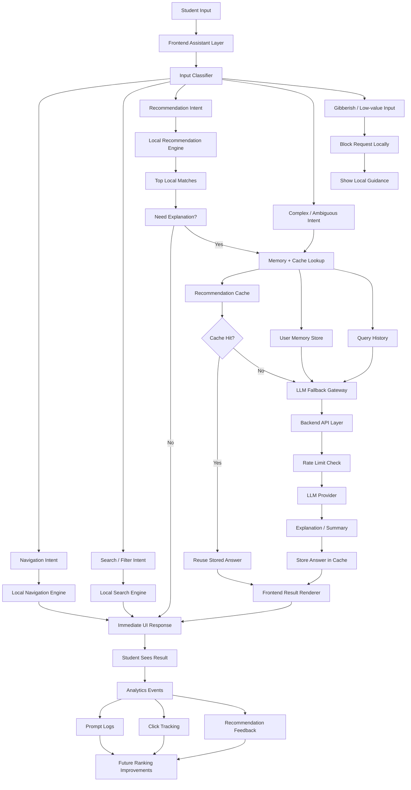

# StudentHelper AI Memory Integration

## Local Recommendation + LLM Explanation Fallback

### Goal
StudentHelper should answer most student requests locally for speed and cost control, and only use the LLM when explanation, ambiguity handling, or personalization adds clear value.

### Product Behavior
- Use local search and recommendation logic first
- Reuse past answers when a similar question has already been solved
- Call the LLM only for:
  - explanation
  - summarization
  - ambiguous requests
  - personalized recommendation refinement
- Store useful AI answers for future reuse

### Recommended Backend Additions
- `recommendation_cache`
  - Stores normalized queries and reusable answers
- `user_memory`
  - Stores lightweight student preferences and context
- `query_logs`
  - Stores prompts, intents, and fallback decisions
- `resource_interactions`
  - Stores clicks, saves, and opens for future ranking

### Minimal Data Model

#### `user_memory`
- `id`
- `user_key`
- `major`
- `budget_preference`
- `favorite_categories`
- `last_active_at`

#### `query_logs`
- `id`
- `user_key`
- `original_query`
- `normalized_query`
- `intent_type`
- `handled_by`
- `created_at`

#### `recommendation_cache`
- `id`
- `normalized_query`
- `intent_type`
- `answer_summary`
- `resource_ids`
- `explanation_text`
- `usage_count`
- `last_used_at`
- `created_at`

#### `resource_interactions`
- `id`
- `user_key`
- `resource_id`
- `action_type`
- `created_at`

## Mermaid Architecture

## Integration Flow

### Frontend
- Keep current local-first behavior
- After local matches are found:
  - return direct results when confidence is high
  - request backend explanation only when useful
- Keep gibberish blocking in frontend

### Backend
- Add `POST /api/recommend`
- Normalize query
- Check cache first
- Load lightweight user memory if available
- Call LLM only on cache miss or low-confidence cases
- Save reusable answer into `recommendation_cache`

### LLM Role
- Do not generate all recommendations from scratch
- Only:
  - explain why local matches fit
  - resolve ambiguity
  - summarize best options
  - personalize final response

## Why This Is Strong for Hackathon Judging
- Faster than full-LLM chat
- Lower token usage under free-model rate limits
- More robust during demo conditions
- Shows real system design, not just API wrapping
- Demonstrates memory, caching, and response optimization

## Technical Innovation Slide

### Title
`Technical Innovation`

### Bullet Points
- Built a hybrid AI system that uses local recommendation first and LLM fallback only when explanation or ambiguity handling is needed
- Added a memory-backed response optimization layer using query history, cache, and lightweight user context
- Reduced token usage and latency by reusing high-value past answers instead of calling the LLM for every request
- Designed the backend to remain reliable under free-model rate limits through local blocking, cache reuse, and selective AI calls
- Structured the platform for future personalization through interaction tracking and ranking improvements

### Speaker Note
Our technical innovation is not just that we integrated an LLM. We built a layered AI system that decides when AI is actually necessary. Most requests are solved locally for speed. When deeper reasoning is needed, the backend checks memory and cache before calling the model. This makes the system faster, cheaper, and more reliable while also creating a path toward long-term personalization.
